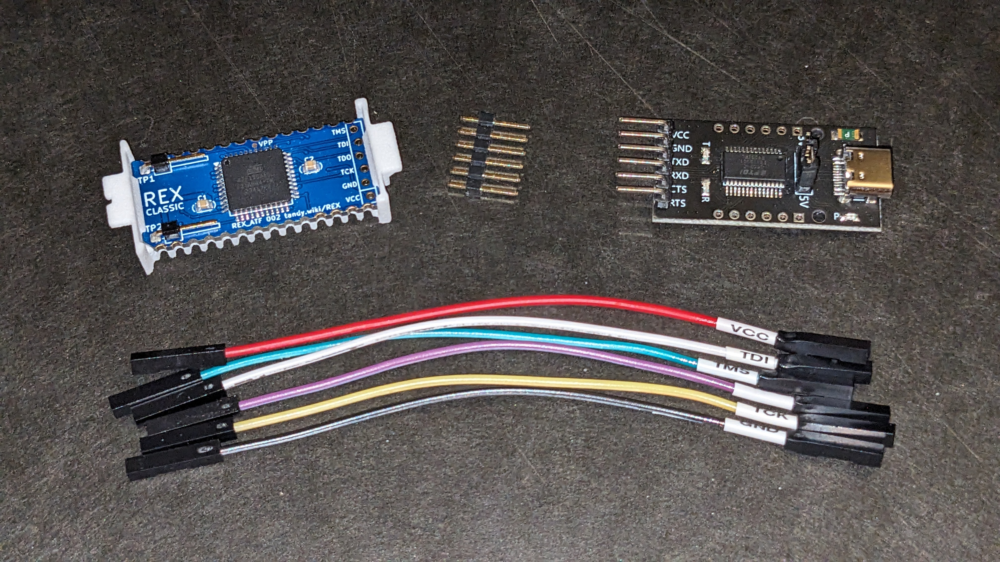

# How to generate the .svf from the VHDL source

## Install Quartus 13.0  
You can omit ModelSim and all device families except MAX7000 if you want a smaller install.  
Directions for Ubuntu 23.10: https://gist.github.com/bkw777/a6a2888f482802f2e520165858268cd3

## Install ATMISP, 5vcomp, openocd, and some wrapper scripts
https://github.com/bkw777/ATF150x_uDEV/blob/main/programming.md  
Basically do the entire "Here is a start to finish install on Ubuntu 23.10"  
You don't need wincupl for this project, but you do need everything else.  

## Install POF2JED
You also need POF2JED which is not mentioned above because that document only covers the WINCUPL workflow, but you get pof2jed from the same place as atmisp and wincupl, and install the same way in the same wine environment:
```
$ wget http://ww1.microchip.com/downloads/archive/pof2jed.zip
$ unzip pof2jed.zip
$ wine_atmel WinPof2jed45.exe
$ cat >~/.local/bin/pof2jed <<%EOF
#!/bin/sh
# Wrapper to run POF2JED
# Install in ~/.local/bin along with wine_atmel

wine_atmel c:/pof2jed/bin/pof2jed.exe "\$@"
%EOF
$ chmod 755 ~/.local/bin/pof2jed
$ cat >~/.local/bin/winpof2jed <<%EOF 
#!/bin/sh
# Wrapper to run WinPOF2JED
# Install in ~/.local/bin along with wine_atmel

# "start" not needed to run, but makes the help buttons work
wine_atmel start c:/pof2jed/bin/winpof2jed.exe "\$@"
%EOF
$ chmod 755 ~/.local/bin/winpof2jed
```

## Compile the VDHL to POF
```
$ cd .../HDL/rexbrd
$ q13 rexbrd
```

Press the play button to generate `output_files/rexbrd.pof`  

## Convert MAX7000S POF to ATF1504AS JED
```
$ cd output_files
$ pof2jed -verbose -device 1504as -JTAG on -TDI_PULLUP -TMS_PULLUP rexbrd
```

## Convert JED to SVF
https://github.com/bkw777/ATF150x_uDEV/blob/main/programming.md#convert-the-jed-to-svf

## Setup JTAG programmer hardware
https://github.com/bkw777/ATF150x_uDEV/blob/main/programming.md#hardware)  
To make the physical JTAG connection, you only need 6 female-female dupont wires and a 6-pin length of common 2.54mm single-row square pin header.  
In these pics, the usbc module has a FT232R chip, so the pinout follows the FT232R table in the programming doc above.  
TX-TCK  
RX-TDI  
CTS-TMS  
RTS-TDO  



## Program the SVF to the chip
https://github.com/bkw777/ATF150x_uDEV/blob/main/programming.md#program-the-device-with-the-svf

