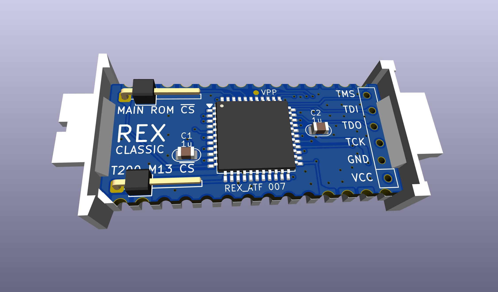
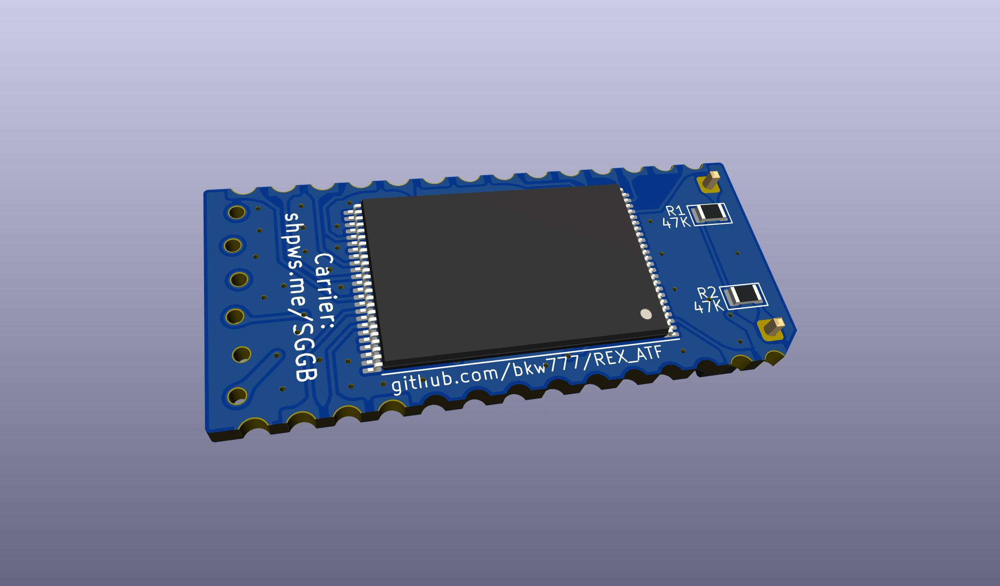

# REX_ATF

**NOT WORKING  -  NOT WORKING  -  NOT WORKING**

Do not bother trying to build this yet unless you actually want to help GET it working.  
Because it DOES NOT WORK yet. But it seems to be close...

Current Status:

The code compiles and creates a .pof,  
and pof2jed creates a .jed,  
and atmisp creates a .svf,  
openocd programs the svf to the device.

But if the REX is installed in the option rom socket then it prevents the machine from booting.  
CSA and CSB (main rom /CS and t200 ext /CS) are low when unconnected, which is activating the REX main rom logic "selecting" the virtual main rom on the rex at all times.  

Externally pulling both pins high allows the machine to run normally.  
`rf149.co` runs without error.  
CALL 63012 hangs.

Trying both a VHDL change and a project build option to init the pins high.  
The xilinx UCF file calls out internal pullups on all the control pins including CSA & CSB (cs_MAIN1 & cs_MAIN2A in the original code), but there doesn't see to be an equivalent feature available in MAX7000S.  
ATF1504AS has a pin keeper feature which might be equivalent, but Quartus isn't actually targeting ATF1504AS, it's targeting EPM7064S.  
Presumably Prochip would properly know the devices full features, but Prochip is unavailable.  
Possibly just setting the pin high in VHDL, possibly combined with pof2jed -pin_keep may work.

Mishandled ALE.  
ALE is the main clock for the design.  
ALE is on pin 39 on the original Xilinx design, and pin 39 is a GCLK pin on XCR3064.  
ALE was on pin 39 here too, but pin 39 is not a GCLK pin on ATF1504,  
so, moved ALE to pin 40, and declred as global clock in pin assignments.

These changes not tested yet.

----

[REX Classic](http://tandy.wiki/REX) built on Microchip ATF1504 instead of Xilinx XCR3064

  
  
  
  
  

# What is it?

REX Classic is an on-board software-controlled rom library for TRS-80 Model 100, 102, or 200.

REX was originally designed around a Xilinx XCR3064XL CPLD, but Xilinx has stopped producing those.

This is a version of REX Classic using the same VHDL code, but compiled for a Microchip ATF1504ASL CPLD, which is still an active part.

# BOM

1 x ATF1504ASL TQFP44 - CPLD 64MC 5V  
https://www.digikey.com/en/products/detail/microchip-technology/ATF1504ASL-25AU44/1008353

1 x 29F800BB TSOP48 ex: AM29F800BB, M29F800FB, MX29F800CB - 8Mx8/4Mx16 FLASH parallel 5V bottom-boot  
https://www.digikey.com/en/products/detail/alliance-memory-inc/M29F800FB5AN6F2/12180108

2 x 1uF MLCC 0805 16V+  
https://www.digikey.com/en/products/detail/yageo/CC0805KKX7R7BB105/2103103

Gerbers & CPLD bitstream in [releases](../../releases/latest). (not working yet, so no release yet)

Carrier: http://shpws.me/SGGB  
(cad model source: https://github.com/bkw777/Molex78802_Module )

# Programming the CPLD
Install [openocd](https://openocd.org/) and a [wrapper script](https://github.com/bkw777/ATF150x_uDEV/blob/main/bin/atfsvf):  
```
$ sudo apt install openocd
$ wget https://github.com/bkw777/ATF150x_uDEV/raw/main/bin/atfsvf
$ install -m 755 atfsvf ~/.local/bin/
```

Programmer hardware:  
 * [FT232R or FT232H usb-ttl module that can supply 5V VCC](https://github.com/bkw777/ATF150x_uDEV/blob/main/programming.md#hardware)
 * 6-pin length of generic 2.54mm single row square male pin header
 * 6 female dupont wires
 * [connection pinout table](https://github.com/bkw777/ATF150x_uDEV/blob/main/programming.md#hardware)

Example using an [FT232R usbc-ttl-serial module](https://amazon.com/dp/B0CQVB6JFV)  


Get the SVF file from [Releases](../../releases/latest). (No releases yet since it doesn't work yet)

Use the atfsvf script to program the chip with the svf.  
If you have a FT232H module instead of FT232R, then change ft232r to ft232h below.  
`$ atfsvf ft232r ATF1504ASL rexbrd.svf`


# Usage
Use the normal [REX Classic](http://bitchin100.com/wiki/index.php?title=REXclassic) software and documentation.


# Generating the SVF from the VHDL source


# Credits
Original REX design is by Steven Adolph  
http://bitchin100.com/wiki/index.php?title=REX  
http://www.club100.org/memfiles/index.php?direction=0&order=&directory=Steve%20Adolph
