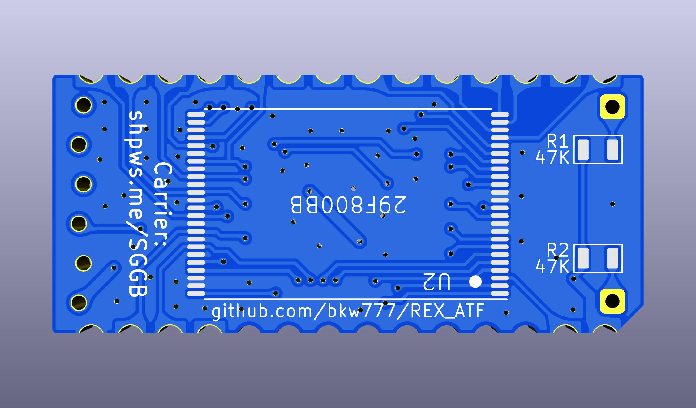

# REX_ATF

**NOT WORKING  -  NOT WORKING  -  NOT WORKING**

Do not bother trying to build this yet unless you actually want to help GET it working.  
Because it DOES NOT WORK yet. But it seems to be close...

Current Status:

The code compiles and creates rexbrd.pof,  
and pof2jed creates rexbrd.jed,  
and atmisp creates rexbrd.svf,  
openocd programs rexbrd.svf to the device.  
`rf149.co` runs without error.  
CALL 63012 hangs.

----

[REX Classic](http://tandy.wiki/REX) built on Microchip ATF1504 instead of Xilinx XCR3064

  
  
  
  
  

# What is it?

REX Classic is an on-board software-controlled rom library for TRS-80 Model 100, 102, or 200.

REX was originally designed around a Xilinx XCR3064XL CPLD, but Xilinx has stopped producing those.

This is a version of REX Classic using the same VHDL code, but compiled for a Microchip ATF1504ASL CPLD, which is still an active part.

# BOM

1 x ATF1504ASL TQFP44 - CPLD 64MC 5V  
https://www.digikey.com/en/products/detail/microchip-technology/ATF1504ASL-25AU44/1008353

1 x 29F800BB TSOP48 ex: AM29F800BB, M29F800FB, MX29F800CB - 8Mx8/4Mx16 FLASH parallel 5V bottom-boot  
https://www.digikey.com/en/products/detail/alliance-memory-inc/M29F800FB5AN6F2/12180108

2 x 1uF MLCC 0805 16V+  
https://www.digikey.com/en/products/detail/yageo/CC0805KKX7R7BB105/2103103

Gerbers & CPLD bitstream in [releases](../../releases/latest). (not working yet, so no release yet)

Carrier: http://shpws.me/SGGB  
(cad model source: https://github.com/bkw777/Molex78802_Module )

# Programming the CPLD
Install [openocd](https://openocd.org/) and a [wrapper script](https://github.com/bkw777/ATF150x_uDEV/blob/main/bin/atfsvf):  
```
$ sudo apt install openocd
$ wget https://github.com/bkw777/ATF150x_uDEV/raw/main/bin/atfsvf
$ install -m 755 atfsvf ~/.local/bin/
```

Programmer hardware:  
 * [FT232R or FT232H usb-ttl module that can supply 5V VCC](https://github.com/bkw777/ATF150x_uDEV/blob/main/programming.md#hardware)
 * 6-pin length of generic 2.54mm single row square male pin header
 * 6 female dupont wires
 * [connection pinout table](https://github.com/bkw777/ATF150x_uDEV/blob/main/programming.md#hardware)

Example using an [FT232R usbc-ttl-serial module](https://amazon.com/dp/B0CQVB6JFV)  


Get the SVF file from [Releases](../../releases/latest). (No releases yet since it doesn't work yet)

Use the atfsvf script to program the chip with the svf.  
If you have a FT232H module instead of FT232R, then change ft232r to ft232h below.  
`$ atfsvf ft232r ATF1504ASL rexbrd.svf`


# Usage
Use the normal [REX Classic](http://bitchin100.com/wiki/index.php?title=REXclassic) software and documentation.


# Generating the SVF from the VHDL source


# Credits
Original REX design is by Steven Adolph  
http://bitchin100.com/wiki/index.php?title=REX  
http://www.club100.org/memfiles/index.php?direction=0&order=&directory=Steve%20Adolph
